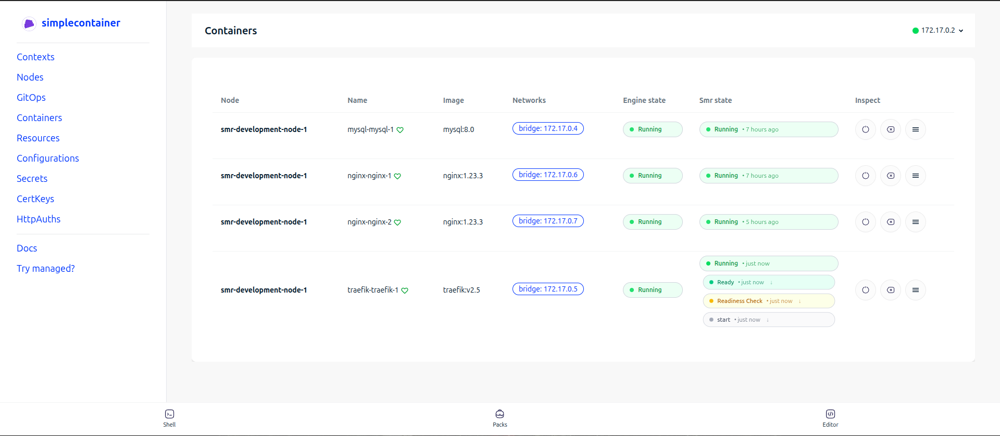
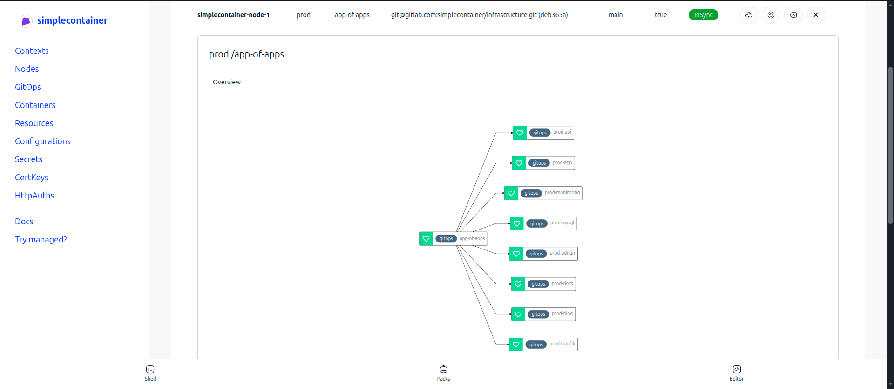

# Dashboard
Dashboard is UI for the simplecontainer nodes. It hooks directly into the control-plane API, and handles 
visual representation and control of resource via UI.

Current state is minimalistic and enables only basic actions. Client (smrctl) is more powerful and allows full control
over the resources.

# Features
- Visualization of all resources currently available 
- GitOps visualizations 
- Gitops control: refresh, sync, delete
- Container control: restart, delete
- Editor for applying resources directly from the dashboard

# How to deploy?
Dashboard can be easily deployed on the simplecontainer nodes directly.
```cgo
git clone https://github.com/simplecontainer/examples
smrctl apply examples/dashboard
```

# How it works?
No authentication is present on the dashboard. Dashboard reads contexts from the directory ~/.smrctl inside of the container.
It is up to the user to provide authentication in front of the dashboard if it is hosted for central usage.

## How it looks?
First image shows interactive container listing that uses WebSocket to track container events in the real time.


Second image shows GitOps (app-of-apps pattern) visualization. It also relies on the WebSocket to provide updates 
in the real time directly on the diagram.


## Security
Simplecontainer control-plane by default is secure because it relies on  mTLS for authentication and encryption fo the data.
Browsers cannot handle mTLS advanced management and certificate-key mangling directly in the browser. Proxy-manager is accompanying dashboard to enable control plane communication.

Dashboard sends to the proxy manager context and it opens reverse proxy to the upstream simplecontainer node.